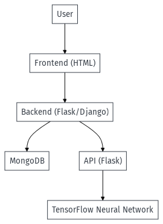

# Nome do Projeto

## 1. O problema

## 2. A Solucao

## 3. Aquitetura 

O projeto é composto por várias camadas, desde o frontend até o backend, incluindo uma API e uma rede neural. Abaixo está um diagrama que ilustra a arquitetura do software:

### Diagrama de Arquitetura de Software

 

### 3.1 Banco de Dados

#### MongoDB

Descrição: Utilizamos o MongoDB como nosso banco de dados para armazenar informações de forma eficiente e escalável.

### 3.2 Frontend

#### HTML

Descrição: A interface do usuário é desenvolvida em HTML, proporcionando uma experiência de usuário amigável e interativa.

### 3.3 Backend

#### Flask/Django

Descrição: O backend é implementado em Python, usando Flask ou Django para gerenciar as requisições e fornecer respostas.

#### API - Flask

Descrição: Uma API desenvolvida em Flask sera usada para interagir com o modelo.

### 3.4 Reconhecimento de Imagens

#### TensorFlow

Descrição: A rede neural sera implementada usando o framework TensorFlow para fornecer o reconhecimento de imagens necessario para esse projeto.

## 4. Monetização do Aplicativo

 A monetização de um aplicativo é uma etapa crucial para garantir sua sustentabilidade e qualidade contínua. Existem diferentes abordagens que podem ser adotadas para garantir que o aplicativo gere receita de forma eficaz. No caso específico deste aplicativo direcionado para clínicas e profissionais da saúde, consideramos duas abordagens distintas:

### 4.1 Para Clínicas

 Uma das estratégias de monetização para clínicas é oferecer diferentes opções de pagamento, adaptando-se ao tamanho e às necessidades de cada estabelecimento. Para clínicas menores, a cobrança por uso do software pode ser uma alternativa vantajosa, já que o custo tende a ser mais acessível e proporciona flexibilidade. Por outro lado, para clínicas de maior porte, a opção de mensalidade com valor fixo pode ser mais atraente, especialmente quando há um grande volume de requisições e a possibilidade de fechar pacotes que atendam às demandas.

 A implementação dessas variações de cobrança não apenas se adapta às realidades financeiras das clínicas, mas também permite uma maior inclusão, atingindo um público mais amplo. Afinal, é importante que o preço seja um fator que caiba no orçamento de cada cliente, garantindo assim a adesão ao produto.

### 4.2 Para Médicos

A monetização em relação aos médicos pode ser abordada de maneira diferente. Aqui, a confiança e a qualidade das informações desempenham um papel fundamental. Uma abordagem seria cobrar uma mensalidade acessível dos profissionais da saúde que desejam utilizar o aplicativo. Isso não apenas gera receita, mas também cria um senso de compromisso contínuo, incentivando os médicos a utilizarem a plataforma de forma regular.

 Além disso, para criar uma base sólida de médicos cadastrados e aumentar a confiabilidade do serviço, pode-se considerar a possibilidade de cobrar um valor fixo no momento do cadastro. Isso ajudaria a filtrar médicos genuinamente interessados, aumentando a qualidade do banco de dados e, consequentemente, a confiança dos usuários.

 Em resumo, a monetização inteligente e adaptada às diferentes necessidades tanto de clínicas quanto de médicos é essencial para o sucesso e a longevidade deste aplicativo. Ao oferecer opções flexíveis e estratégias que valorizam a qualidade e a confiança, é possível criar um ecossistema financeiramente saudável e benéfico para todas as partes envolvidas.

## 5. Planejamento

## Testes

## CI/CD
